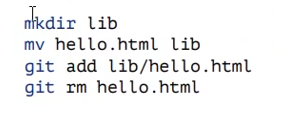
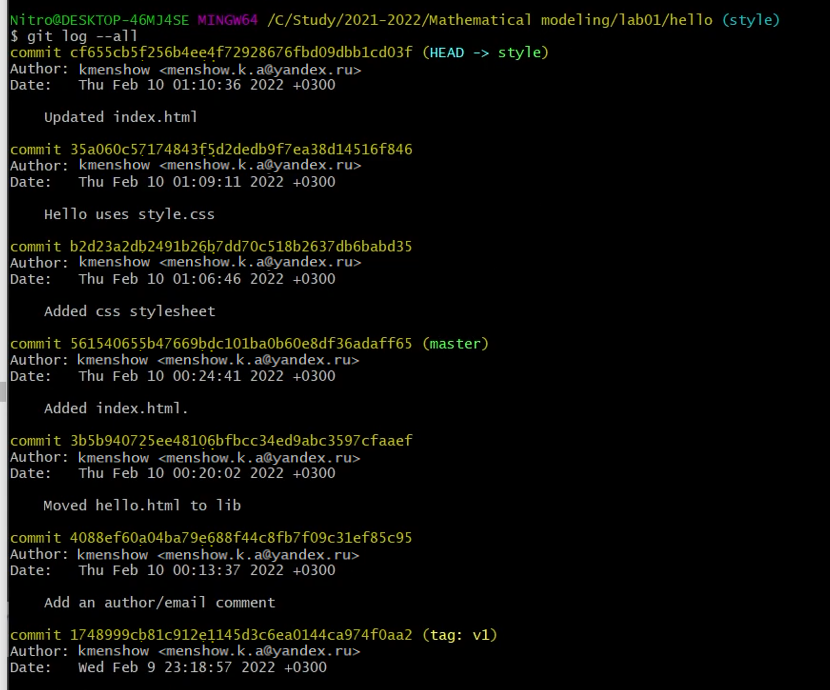
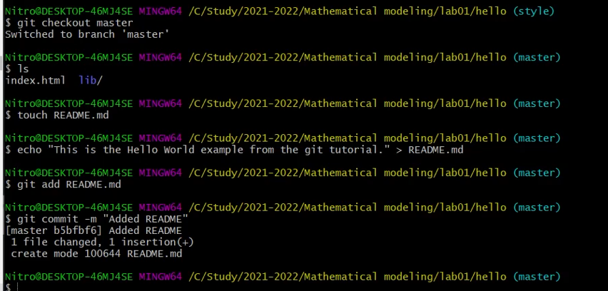

# Отчет по лабораторной работе №1. Работа с git

## Выполнил: Меньшов Константин Эдуардович НФИбд-02-19 1032191342

# Задание
    Необходимо ознакомиться с основными возможностями git, а также научиться работать с markdown

# Выполнение
### 1.1 Подготовка
Для начала мне нужно подготовить окружение. Для этого я устанавливаю имя и e-mail пользователя, от которого будет вестись работа. Также выставляем параметры для корректной работы с текстовыми файлами (в зависимости от типа ОС). У меня все эти параметры уже были установлены, как и сам git.

### 1.2 Создание проекта
Создаю проект hello, в котором создаю файл hello.html. Записываю в этот файл какой-либо текст. После этого делаю данный проект репозиторием, добавляю изменения в индекс и делаю коммит. Проверяю текущее состояние репозитория. 

### 1.3  Внесение изменений
Изменим наш текст. Проверим состояние репозитория - изменения не добавлены в индекс. 

### 1.4  Индексация изменений
Добавляем и смотрим снова. После этого совершаем коммит, только в этот раз без параметра -m, т.е. пишем комментарий в текстовом редакторе. 

Изменим наш текст еще раз, добавим изменения в индекс.  После этого снова изменяем текст и смотрим состояние - наш файл отмечем дважды - одно изменение в индексе и готово к коммиту, второе - нет. 

Делаем коммит и смотрим статус - есть новые изменения. Добавляем оставшиеся изменения в индекс и проверяем статус. После совершаем коммит.

Просматриваем совершенные изменения. Выберем какой-либо предыдущий коммит, запомним его хэш-код и с помощью команды checkout и хэша скопируем его в рабочий репозиторий. Проверим содержимое нашего файла на данном коммите - оно отличается от текущего. 

Вернемся к последней (текущей) версии при помощи git checkout master и проверим содержимое файла для достоверности.

Создадим тег для текущей версии страницы hello - назовем его v1. Перейдем на предыдущую версию изменений и проверим содержимое файла. Установим тег и на эту версию - v1-beta. 
Просматриваем все теги разными способами. 

### 1.5 Отмена локальных изменений (до индексации)
Перейдем в последнюю версию изменений, и изменим наш файл. Мы нонимаем, что это изменение нам не нужно. Смотрим состояние - файл изменен. 

Для отмены изменений воспользуемся git checkout hello.html, смотрим - изменений нет. 

### 1.6 Отмена проиндексированных изменений (перед коммитом)
Воссоздаем предыдущую ситуацию, только в этот раз добавим изменения в индекс. 

Чтобы отменить нежелательные изменения в этом случае, воспользуемся командой git reset HEAD hello.html, а затем тем же алгоритмом, что и на предыдущем шаге. 

### 1.7  Отмена коммитов
Теперь изменим файл и сделаем его нежелательный коммит. Для его отмены сделаем еще один коммит, отменяющий предыдущий. Проверяем логи. 

### 1.8 Удаление коммиттов из ветки
Мы видим, что хоть мы и отменили коммит, в логах они остались - удалим их при помощи сборщика мусора. Отметим эту ветку тегом oops. Сбросим коммит к предыдущему тегу v1 и проверим логи.

Даже после этого удаленные коммиты можно увидеть в расширенных логах.  

### 1.9 Удаление тега oops

Удалим тег oops и проверим историю коммитов - сейчас там нет нежелательных коммитов. 

### 1.10 Внесение изменений в коммиты
Добавил в страницу комментарии автора и закоммитил

Далее, еще изменил текст и чтобы не создавать отдельный коммит, я изменил предыдущий

И в истории можно увидеть, что коммит только один

### 1.11 Перемещение файлов
Перемещаю файл hello.html в каталог lib

### 1.12 Второй способ перемещения файлов
Посмотрел второй вариант перемещения файлов, который идентичен предыдущему пункту.

### 1.13 Подробнее о структуре
Добавил файл index.html и сделал коммит

### 1.14 Git внутри: Каталог .git
Просмотрел каталог .git, базу данных объектов, состоющую из каталогов с именем из двух символов, и прошелся по этим каталогам.

Также просмотрел файл конфигурации, ветки и теги, и файл HEAD.

### 1.15 Работа непосредственно с объектами git
Выведем на экран последний коммит в репозитории командой git log —max-count=1, вывел последний коммит с помощью хэша, затем вывел дерево каталогов, ссылку на который взял в коммите. После этого вывел каталог lib, файл hello.html

### 1.16 Создание ветки
Создал новую ветку style, добавил файл стилей style.css, изменил основную страницу hello.html, чтобы использовать стили, обновил файл index.html, чтобы он тоже использовал style.css.

### 1.17 Навигация по веткам
Переключился на ветку master, просмотрел файл hello.html без стилей, затем вернулся к ветке style и просмотрел файл hello.html, в котором есть стили.

### 1.18 Изменения в ветке master
Создал файл README.md и записал туда строку

### 1.19 Коммит изменений README.md в ветку master
Сделал коммит изменений README.md, просмотрел текущие ветки и их отличия лог-командой git log —graph —all. Команда вызывает построение дерева коммитов с помощью простых ASCII символов, а -all означает, что мы видим все ветки.

### 1.20 Слияние
Вернулся к ветке style и выполнил слияние master с style. 

### 1.21 Создание конфликта
Вернулся в ветку master и внес изменения в файл hello.html, сделал коммит. Затем просмотрел логи веток, последнее изменение в master конфликтует с некоторыми изменениями в style.

### 1.22 Разрешение конфликтов
Вернулся к ветке style и попытался объединить ее с новой веткой master, возник конфликт. Открыл файл hello.html и вучную разрешил конфликт. Затем сделал коммит решения конфликта.

### 1.23 Сброс ветки style
Вернулся к ветке style в точку перед слиянием с master, нашел последний коммит перед слиянием и сбросил ветку style к этому коммиту. Затем проверил ветку, в логах нет коммитов слияний.

### 1.24 Сброс ветки master
Вернулся к ветке master перед внесением конфликтующих изменений. Нашел коммит "Added README" и сбросил ветку к этому коммиту.

### 1.25 Перебазирование
В данном пункте я использую команду rebase, вместо команды merge. И хочу перенести изменения из ветки master в ветку style.

Конечный результат перебазирования очень похож на результат слияния.
Однако, дерево коммитов значительно отличается. Дерево ком-
митов ветки style было переписано таким образом, что ветка master является частью истории коммитов. Это делает цепь коммитов линейной и гораздо более читабельной.
Рекомендуется использовать git
rebase для кратковременных, локальных веток, а слияние для веток в публичном
репозитории.
### 1.26 Слияние в ветку master
Я поддерживал соответствие ветки style с веткой master,
теперь солью изменения style в ветку master.

Теперь ветки style и master идентичны.

### 1.27 Клонирование репозиториев
Для клонирования репозиториев нужно перейти в рабочий каталог и с помощью комманды clone создать clone репозитория

### 1.28 Просмотр клонированного репозитория
Для этого перейдём в клонированный репозиторий и просмотрим его.

Далее просмотрим историю клонированного репозитория. Она совпадает с исходной

### 1.29 Что такое origin?
Выполним команду git remote.

Мы видим, что клонированный репозиторий знает об имени по умолчанию
удаленного репозитория.
Выполним команду git remote show origin.
Удалённые репозитории могут с тем же
успехом указывать на репозиторий на той же машине. Нет ничего особенного
в имени «origin», однако существует традиция использовать «origin» в качестве
имени первичного централизованного репозитория (если таковой имеется).

### 1.30 Удаленные ветки
Для того, чтобы увидеть все ветки, в том числе удалённые, я выполнил следующую команду: git branch -a

### 1.31 Изменение оригинального репозитория
Я внес некоторые изменения в оригинальный репозиторий, чтобы затем попытаться извлечь и слить изменения из удаленной ветки в текущую

Для того, чтобы извлечь изменения я воспользовался командой git fetch

На данный момент в клонированном репозитории есть все коммиты из оригинального репозитория, но они не интегрированы в локальные ветки клонированного репозитория.
Команда git fetch будет извлекать новые коммиты из удаленного репозитория, но не будет сливать их с вашими наработками в
локальных ветках.
Можно посмотреть файл README.md и увидеть, что он не изменился

### 1.32 Слияние извлеченных изменений
Для начала солью извлеченные изменения в локальную ветку master командой merge

Проверяю файл README и вижу, что он изменился
Объединение fetch и merge в одну команду: pull

### 1.33 Добавление ветки наблюдения
Добавляю локальную ветку, которая отслеживает удаленную ветку
Для этого:

### 1.34 Чистые репозитории
Чистые репозитории (без рабочих каталогов) обычно используются для расшаривания. Обычный git-репозиторий подразумевает, что вы будете использовать
его как рабочую директорию, поэтому вместе с файлами проекта в актуальной
версии, git хранит все служебные, «чисто-репозиториевские» файлы в поддиректории .git. В удаленных репозиториях нет смысла хранить рабочие файлы на диске, а все что им действительно нужно — это дельты изменений и другие бинарные данные репозитория. Вот это и есть «чистый
репозиторий».

### 1.35 Создайте чистый репозиторий
Для создания чистого репозитория воспользуюсь командой

Как правило, репозитории, оканчивающиеся на .git являются чистыми репозиториями

### 1.36 Добавление удаленного репозитория
Добавляем репозиторий hello.git к нашему оригинальному репозиторию.

### 1.37 Отправка изменений
Для этого я отредактировал файл README.md и сделал коммит
Затем отправил изменения в общий репозиторий.

### 1.38 Извлечение общих изменений
Для этого я выполнил ряд комманд

# Вывод
    Ознакомился с основными возможностями git, а также научиться работать с markdown