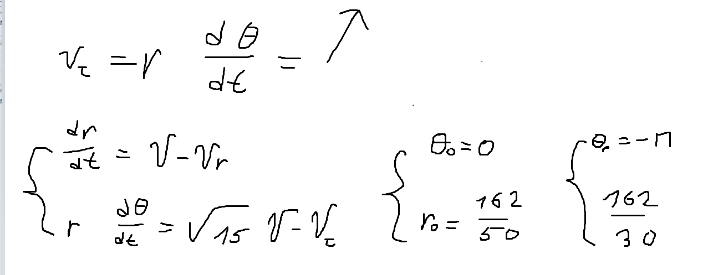
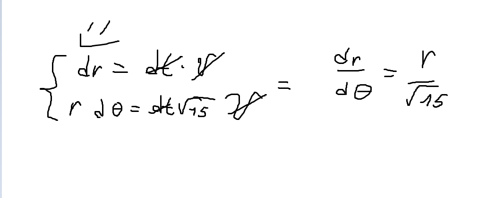
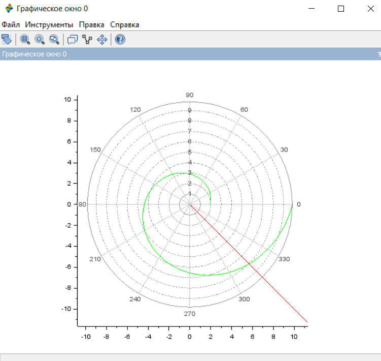
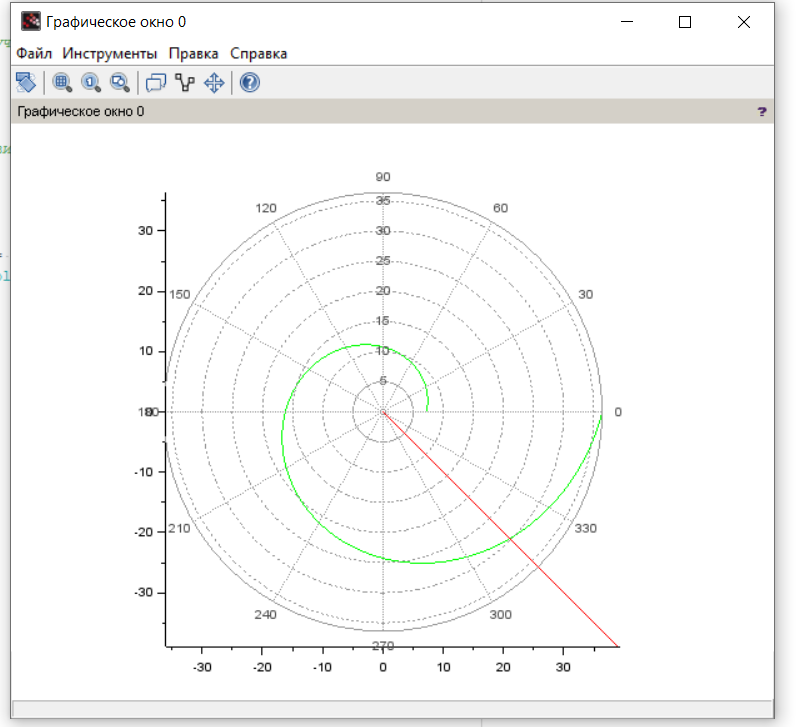
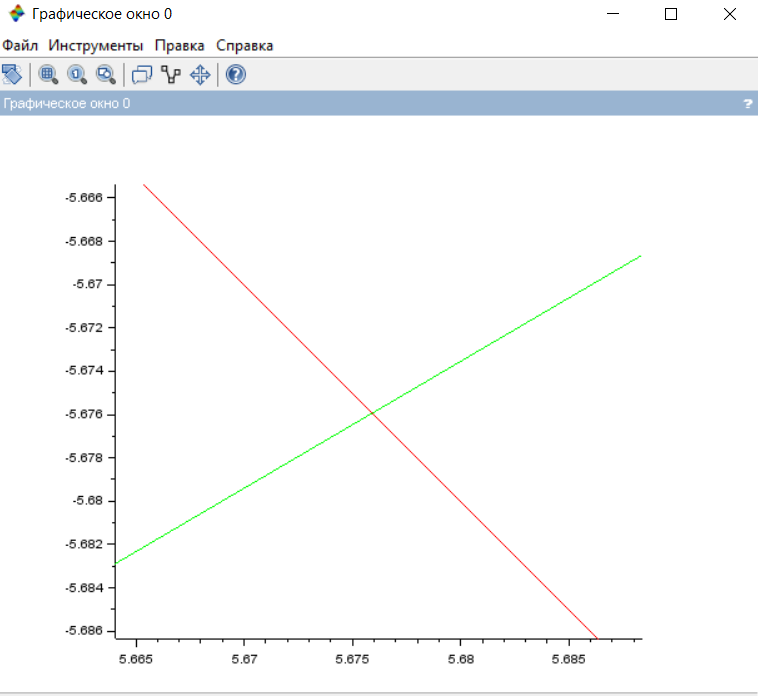
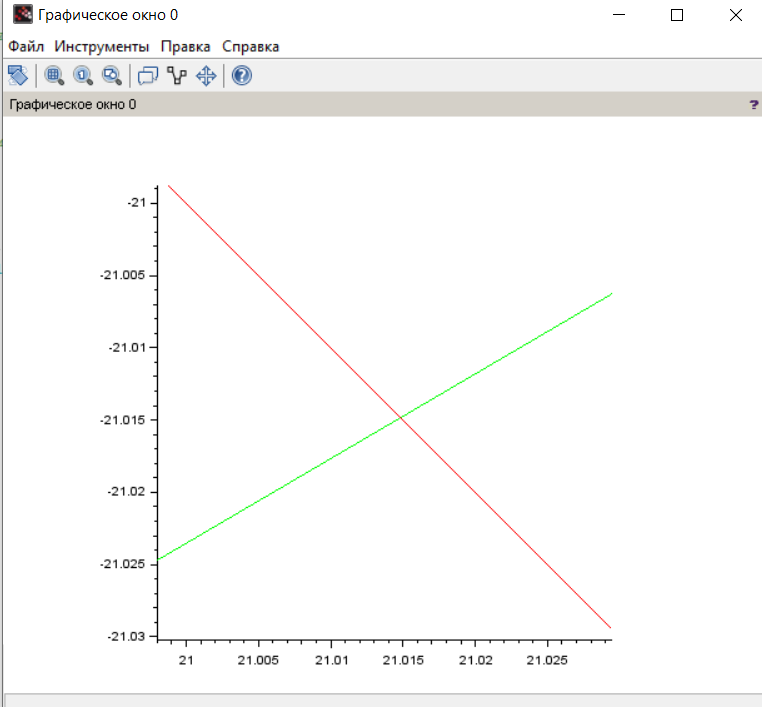

---
# Front matter

# Generic otions
lang: ru-RU
toc-title: "Содержание"

# Bibliography
bibliography: bib/cite.bib
csl: pandoc/csl/gost-r-7-0-5-4308-numeric.csl

# Pdf output format
toc: true # Table of contents
toc_depth: 2
lof: true # List of figures
lot: true # List of tables
fontsize: 12pt
linestretch: 1.5
papersize: a4
documentclass: scrreprt
## I18n
polyglossia-lang:
  name: russian
  options:
	- spelling=modern
	- babelshorthands=true
polyglossia-otherlangs:
  name: english
### Fonts
mainfont: PT Serif
romanfont: PT Serif
sansfont: PT Sans
monofont: PT Mono
mainfontoptions: Ligatures=TeX
romanfontoptions: Ligatures=TeX
sansfontoptions: Ligatures=TeX,Scale=MatchLowercase
monofontoptions: Scale=MatchLowercase,Scale=0.9
## Biblatex
biblatex: true
biblio-style: "gost-numeric"
biblatexoptions:
  - parentracker=true
  - backend=biber
  - hyperref=auto
  - language=auto
  - autolang=other*
  - citestyle=gost-numeric
## Misc options
indent: true
header-includes:
  - \linepenalty=10 # the penalty added to the badness of each line within a paragraph (no associated penalty node) Increasing the value makes tex try to have fewer lines in the paragraph.
  - \interlinepenalty=0 # value of the penalty (node) added after each line of a paragraph.
  - \hyphenpenalty=50 # the penalty for line breaking at an automatically inserted hyphen
  - \exhyphenpenalty=50 # the penalty for line breaking at an explicit hyphen
  - \binoppenalty=700 # the penalty for breaking a line at a binary operator
  - \relpenalty=500 # the penalty for breaking a line at a relation
  - \clubpenalty=150 # extra penalty for breaking after first line of a paragraph
  - \widowpenalty=150 # extra penalty for breaking before last line of a paragraph
  - \displaywidowpenalty=50 # extra penalty for breaking before last line before a display math
  - \brokenpenalty=100 # extra penalty for page breaking after a hyphenated line
  - \predisplaypenalty=10000 # penalty for breaking before a display
  - \postdisplaypenalty=0 # penalty for breaking after a display
  - \floatingpenalty = 43000 # penalty for splitting an insertion (can only be split footnote in standard LaTeX)
  - \raggedbottom # or \flushbottom
  - \usepackage{float} # keep figures where there are in the text
  - \floatplacement{figure}{H} # keep figures where there are in the text
---

<h1 align="center">

РОССИЙСКИЙ УНИВЕРСИТЕТ ДРУЖБЫ НАРОДОВ 

Факультет физико-математических и естественных наук  

Кафедра прикладной информатики и теории вероятностей

ОТЧЕТ ПО ЛАБОРАТОРНОЙ РАБОТЕ №2
  
<h2  align="right">

дисциплина: Математическое моделирование

Преподователь: Кулябов Дмитрий Сергеевич

Студент: Меньшов Константин Эдуардович

Группа: НФИбд-02-19
  
  
<h1 align="center">

МОСКВА

2022 г.
</h1>

# **Цель работы** 

Цель данной работы - научиться выполнять построения математических моделей для выбора правильной стратегии при решении задач поиска.

# **Условия задачи**

Вариант 43

На море в тумане катер береговой охраны преследует лодку браконьеров.
Через определенный промежуток времени туман рассеивается, и лодка
обнаруживается на расстоянии 16,2 км от катера. Затем лодка снова скрывается в
тумане и уходит прямолинейно в неизвестном направлении. Известно, что скорость
катера в 4 раза больше скорости браконьерской лодки.

# **Теоретическое введение** 

Scilab – это система компьютерной математики, которая предназначена для выполнения
инженерных и научных вычислений, таких как:

* решение нелинейных уравнений и систем;
* решение задач линейной алгебры;
* решение задач оптимизации;
* дифференцирование и интегрирование;
* задачи обработка экспериментальных данных (интерполяция и аппроксимация,
метод наименьших квадратов);
* решение обыкновенных дифференциальных уравнений и систем.

Кроме того, Scilab предоставляет широкие возможности по созданию и
редактированию различных видов графиков и поверхностей

# **Выполнение лабораторной работы** 

***1 Вывод уравнения движения катера***

Вводим начальные данные и описываем уравнение
Принимаем за t0 = 0, xл0 = 0 - место нахождения лодки браконьеров в момент обнаружения, xк0 = 19,1 - место нахождения катера береговой охраны относительно лодки браконьеров в момент обнаружения лодки.

Находим расстояние, после которого катер начнет двигаться вокруг полюса: 
Пусть через время t катер и лодка окажутся на одном расстоянии x от полюса. За это время лодка пройдет x, а катер k - x (или k + x, в зависимости от начального положения катера). Время, за которое они пройдут это расстояние, вычисляется как x/v или (k+-x)/nv соответственно, которые мы и приравниваем, чтобы найти недостающие данные.

После того, как катер береговой охраны окажется на одном расстоянии от полюса, что и лодка, он должен сменить прямолинейную траекторию и начать двигаться вокруг полюса.

Для этого скорость катера раскладываем на две составляющие:
1. радиальную скорость
2. тангенциальную скорость

Решение исходной задачи сводится к решению системы из двух
дифференциальных уравнений с двумя начальными условиями, зависящими от изначального расположения лодки относительно полюса:

Которые мы можем преобразовать к следующему виду:

***2 Построение траектории движения катера***

Вводим первые начальные условия:

Получаем следующий график график:

Вводим вторые начальные условия:

Получаем следующий график график:

***3 Нахождение точки пересечения траекторий***

При помощи графиков находим точки пересечения катера и лодки на первом графике: 5.675 и -5.675

и на втором графике: 21.015 и - 21.015

# Выводы

Благодаря данной лабораторной работе я научился выполнять построения математических моделей для выбора правильной стратегии при решении задач поиска.

# Список литературы

1. Кулябов, Д.С. Лабораторная работа №2 [Текст] / Д.С.Кулябов. - Москва: - 4 с.

    

    

