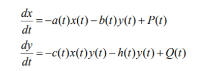
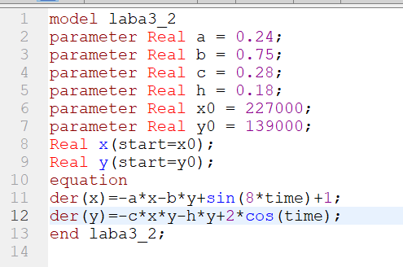

---
# Front matter
title: "Лабораторная работа 3"
author: "Меньшов Константин Эдуардович, НФИбд-02-19"

# Generic otions
lang: ru-RU
toc-title: "Содержание"

# Bibliography
bibliography: bib/cite.bib
csl: pandoc/csl/gost-r-7-0-5-4308-numeric.csl

# Pdf output format
toc: true # Table of contents
toc_depth: 2
lof: true # List of figures
lot: true # List of tables
fontsize: 12pt
linestretch: 1.5
papersize: a4
documentclass: scrreprt
## I18n
polyglossia-lang:
  name: russian
  options:
	- spelling=modern
	- babelshorthands=true
polyglossia-otherlangs:
  name: english
### Fonts
mainfont: PT Serif
romanfont: PT Serif
sansfont: PT Sans
monofont: PT Mono
mainfontoptions: Ligatures=TeX
romanfontoptions: Ligatures=TeX
sansfontoptions: Ligatures=TeX,Scale=MatchLowercase
monofontoptions: Scale=MatchLowercase,Scale=0.9
## Biblatex
biblatex: true
biblio-style: "gost-numeric"
biblatexoptions:
  - parentracker=true
  - backend=biber
  - hyperref=auto
  - language=auto
  - autolang=other*
  - citestyle=gost-numeric
## Misc options
indent: true
header-includes:
  - \linepenalty=10 # the penalty added to the badness of each line within a paragraph (no associated penalty node) Increasing the value makes tex try to have fewer lines in the paragraph.
  - \interlinepenalty=0 # value of the penalty (node) added after each line of a paragraph.
  - \hyphenpenalty=50 # the penalty for line breaking at an automatically inserted hyphen
  - \exhyphenpenalty=50 # the penalty for line breaking at an explicit hyphen
  - \binoppenalty=700 # the penalty for breaking a line at a binary operator
  - \relpenalty=500 # the penalty for breaking a line at a relation
  - \clubpenalty=150 # extra penalty for breaking after first line of a paragraph
  - \widowpenalty=150 # extra penalty for breaking before last line of a paragraph
  - \displaywidowpenalty=50 # extra penalty for breaking before last line before a display math
  - \brokenpenalty=100 # extra penalty for page breaking after a hyphenated line
  - \predisplaypenalty=10000 # penalty for breaking before a display
  - \postdisplaypenalty=0 # penalty for breaking after a display
  - \floatingpenalty = 43000 # penalty for splitting an insertion (can only be split footnote in standard LaTeX)
  - \raggedbottom # or \flushbottom
  - \usepackage{float} # keep figures where there are in the text
  - \floatplacement{figure}{H} # keep figures where there are in the text
---

<h1 align="center">

РОССИЙСКИЙ УНИВЕРСИТЕТ ДРУЖБЫ НАРОДОВ 

Факультет физико-математических и естественных наук  

Кафедра прикладной информатики и теории вероятностей

ОТЧЕТ ПО ЛАБОРАТОРНОЙ РАБОТЕ №3
  
<h2 align="right">

дисциплина: Математическое моделирование

Преподователь: Кулябов Дмитрий Сергеевич

Студент: Меньшов Константин Эдуардович

Группа: НФИбд-02-19
  
  
<h1 align="center">

МОСКВА

2022 г.
</h1>

# **Цель работы**

Построение простейших моделей боевых действий – модели Ланчестера

# **Теоретическое введение**

OpenModelica это бесплатное программное обеспечение для численного моделирования в физической системе.
Основанный на Modelica, он позволяет моделировать,  оптимизировать и анализировать сложные физические системы.

# **Условия задачи**

**Вариант - 43**

Между страной Х и страной У идет война. Численность состава войск исчисляется от начала войны, и являются временными функциями x(t) и y(t). В начальный момент времени страна Х имеет армию численностью  227 000 человек, а в распоряжении страны У армия численностью в  139 000 человек. Для упрощения модели считаем, что коэффициенты
a, b, c, h постоянны. Также считаем P(t) и Q(t) непрерывные функции. Нужно построить графики изменения численности войск армии Х и армии У для
следующих случаев:

1. Модель боевых действий между регулярными войсками
2. Модель ведение боевых действий с участием регулярных войск и партизанских отрядов

# **Выполнение лабораторной работы**

**_1. Построение модели боевых действий между регулярными войсками_**

В этом случае модель боевых действий между регулярными войсками описывается следующим образом

Потери, не связанные с боевыми действиями, описывают члены a(t)x(t) и h(t)y(t), члены b(t)y(t) и c(t)x(t) отражают потери на поле боя. Коэффициенты b(t) и c(t) указывают на эффективность боевых действий со стороны у и х соответственно, a(t),h(t) - величины, характеризующие степень влияния различных факторов на потери. Функции P(t),Q(t) учитывают возможность подхода подкрепления к войскам Х и У в течение одного дня.

Модель боевых действий между регулярными войсками описывается следующими уравнениями:

Для построения модели мы используем следующий скрипт:

В итоге получаем следующий график:

Мы видим, что армия страны Y быстрее достигнет нуля, чем армия X, следовательно страна Y проиграет в войне.

**_2. Построение модели боевых действий между регулярными войсками с партизанскими отрядами_**

В этом случае в борьбу добавляются партизанские отряды. Нерегулярные войска в отличии от постоянной армии менее уязвимы, так как действуют скрытно, в этом случае сопернику приходится действовать неизбирательно, по площадям, занимаемым партизанами. Поэтому считается, что тем потерь партизан, проводящих свои операции в разных местах на некоторой известной территории, пропорционален не только численности армейских соединений, но и численности самих партизан. В результате модель принимает вид: 

Модель боевых действий между регулярными войсками с партизанскими отрядами в нашем варианте варианте:

Для построения модели мы используем следующий скрипт:

В итоге получаем следующий график:

Мы видим, что практически сразу армия страны Y достигает нуля, следовательно победу в войне одержит страна X.

# Выводы

Мы научились выполнять построения математических моделей: Модель боевых действий между регулярными войсками, Модель ведение боевых действий с участием регулярных войск и партизанских отрядов в OpenModelica.

# Список литературы

1. Кулябов, Д.С. - Модель боевых действий
