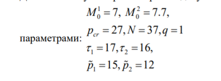
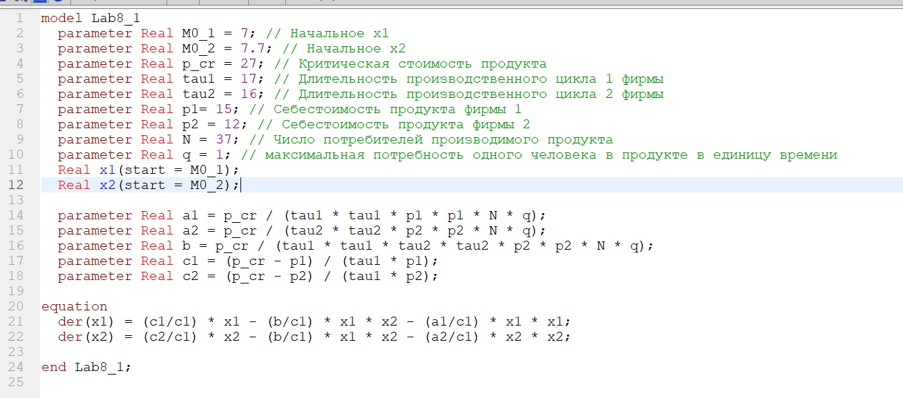
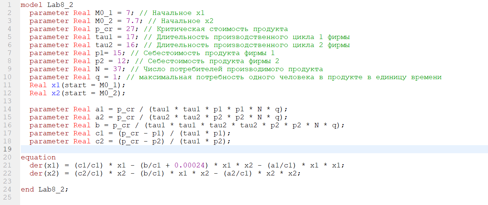

<h1 align="center">

РОССИЙСКИЙ УНИВЕРСИТЕТ ДРУЖБЫ НАРОДОВ 

Факультет физико-математических и естественных наук  

Кафедра прикладной информатики и теории вероятностей

ПРЕЗЕНТАЦИЯ ПО ЛАБОРАТОРНОЙ РАБОТЕ №8
  
<h2 align="right">

дисциплина: Математическое моделирование

Преподователь: Кулябов Дмитрий Сергеевич

Студент: Меньшов Константин Эдуардович

Группа: НФИбд-02-19
  
  
<h1 align="center">

МОСКВА

2022 г.
</h1>

# **Прагматика выполнения лабораторной работы**

- знакомство с моделью конкуренции двух фирм
- работа с OpenModelica

---

# **Цель работы**

Построение модели конкуренции двух фирм

---

# Задачи выполнения лабораторной работы

Для случаев: две фирмы, производящие взаимозаменяемые товары
одинакового качества и находящиеся в одной рыночной нише и модель, когда, помимо экономического фактора влияния, используются еще и социально-психологические факторы

1. Постройте графики изменения оборотных средств фирмы 1 и фирмы 2 без
учета постоянных издержек и с веденной нормировкой для случая 1.
2. Постройте графики изменения оборотных средств фирмы 1 и фирмы 2 без
учета постоянных издержек и с веденной нормировкой для случая 2.

---

# Задачи выполнения лабораторной работы

1 случай:

---

# Задачи выполнения лабораторной работы

2 случай:

---

# **Выполнение лабораторной работы**

**_Построение модели конкуренции двух фирм_**

Для обоих случаев рассмотрим задачу со следующими начальными условиями и
параметрами:

---

Чтобы построить графики изменения оборотных средств фирмы 1 и фирмы 2 без
учета постоянных издержек и с веденной нормировкой для случая 1, я написал следующий код:

---

и получил график:

---

Чтобы построить графики изменения оборотных средств фирмы 1 и фирмы 2 без
учета постоянных издержек и с веденной нормировкой для случая 2, я написал следующий код:

---

и получил график:

---

# Выводы

После завершения данной лабораторной работы - я научился выполнять построение модели конкуренции двух фирм без учета постоянных издержек и с веденной нормировкой в OpenModelica.
