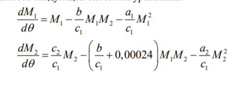
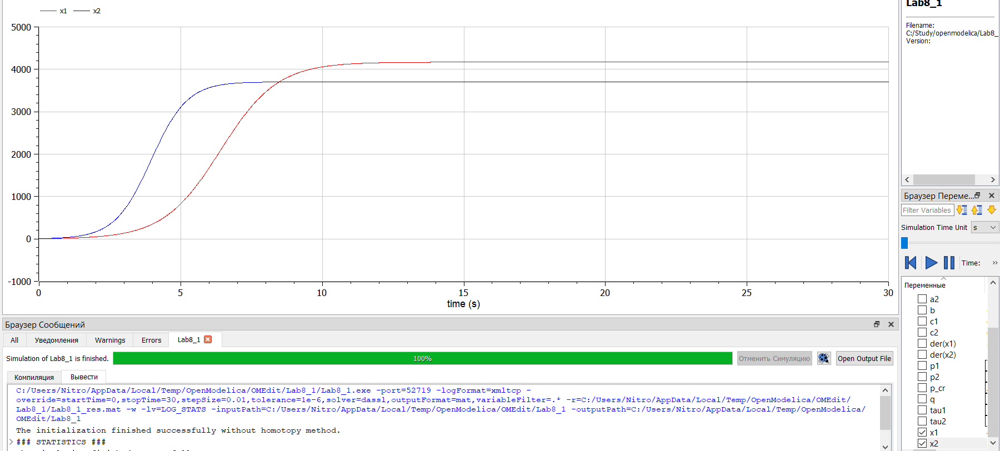
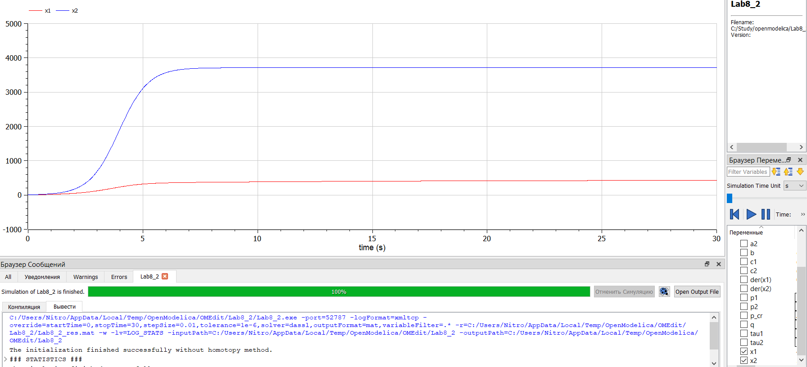

---
# Front matter
title: "Лабораторная работа 8"
author: "Меньшов Константин Эдуардович, НФИбд-02-19"

# Generic otions
lang: ru-RU
toc-title: "Содержание"

# Bibliography
bibliography: bib/cite.bib
csl: pandoc/csl/gost-r-7-0-5-4308-numeric.csl

# Pdf output format
toc: true # Table of contents
toc_depth: 2
lof: true # List of figures
lot: true # List of tables
fontsize: 12pt
linestretch: 1.5
papersize: a4
documentclass: scrreprt
## I18n
polyglossia-lang:
  name: russian
  options:
	- spelling=modern
	- babelshorthands=true
polyglossia-otherlangs:
  name: english
### Fonts
mainfont: PT Serif
romanfont: PT Serif
sansfont: PT Sans
monofont: PT Mono
mainfontoptions: Ligatures=TeX
romanfontoptions: Ligatures=TeX
sansfontoptions: Ligatures=TeX,Scale=MatchLowercase
monofontoptions: Scale=MatchLowercase,Scale=0.9
## Biblatex
biblatex: true
biblio-style: "gost-numeric"
biblatexoptions:
  - parentracker=true
  - backend=biber
  - hyperref=auto
  - language=auto
  - autolang=other*
  - citestyle=gost-numeric
## Misc options
indent: true
header-includes:
  - \linepenalty=10 # the penalty added to the badness of each line within a paragraph (no associated penalty node) Increasing the value makes tex try to have fewer lines in the paragraph.
  - \interlinepenalty=0 # value of the penalty (node) added after each line of a paragraph.
  - \hyphenpenalty=50 # the penalty for line breaking at an automatically inserted hyphen
  - \exhyphenpenalty=50 # the penalty for line breaking at an explicit hyphen
  - \binoppenalty=700 # the penalty for breaking a line at a binary operator
  - \relpenalty=500 # the penalty for breaking a line at a relation
  - \clubpenalty=150 # extra penalty for breaking after first line of a paragraph
  - \widowpenalty=150 # extra penalty for breaking before last line of a paragraph
  - \displaywidowpenalty=50 # extra penalty for breaking before last line before a display math
  - \brokenpenalty=100 # extra penalty for page breaking after a hyphenated line
  - \predisplaypenalty=10000 # penalty for breaking before a display
  - \postdisplaypenalty=0 # penalty for breaking after a display
  - \floatingpenalty = 43000 # penalty for splitting an insertion (can only be split footnote in standard LaTeX)
  - \raggedbottom # or \flushbottom
  - \usepackage{float} # keep figures where there are in the text
  - \floatplacement{figure}{H} # keep figures where there are in the text
---

<h1 align="center">

РОССИЙСКИЙ УНИВЕРСИТЕТ ДРУЖБЫ НАРОДОВ 

Факультет физико-математических и естественных наук  

Кафедра прикладной информатики и теории вероятностей

ОТЧЕТ ПО ЛАБОРАТОРНОЙ РАБОТЕ №8
  
<h2 align="right">

дисциплина: Математическое моделирование

Преподователь: Кулябов Дмитрий Сергеевич

Студент: Меньшов Константин Эдуардович

Группа: НФИбд-02-19
  
  
<h1 align="center">

МОСКВА

2022 г.
</h1>

# **Цель работы**

Построение модели конкуренции двух фирм.

# **Теоретическое введение**

Для построения модели конкуренции хотя бы двух фирм необходимо рассмотреть модель одной фирмы. Вначале рассмотрим модель фирмы, производящей продукт долговременного пользования, когда цена его определяется балансом спроса и предложения. Примем, что этот продукт занимает определенную нишу рынка и конкуренты в ней отсутствуют.

Обозначим:
N – число потребителей производимого продукта.
S – доходы потребителей данного продукта. Считаем, что доходы всех
потребителей одинаковы. Это предположение справедливо, если речь идет об
одной рыночной нише, т.е. производимый продукт ориентирован на определенный
слой населения.
M – оборотные средства предприятия
τ – длительность производственного цикла
p – рыночная цена товара
p̃ – себестоимость продукта, то есть переменные издержки на производство
единицы продукции.
δ – доля оборотных средств, идущая на покрытие переменных издержек.
κ – постоянные издержки, которые не зависят от количества выпускаемой
продукции.

Q(S/p) – функция спроса, зависящая от отношения дохода S к цене p. Она равна количеству продукта, потребляемого одним потребителем в единицу времени.
Функцию спроса товаров долговременного использования часто представляют в простейшей форме:

где q – максимальная потребность одного человека в продукте в единицу времени. Эта функция падает с ростом цены и при p = pcr (критическая стоимость продукта) потребители отказываются от приобретения товара.
Величина pcr = Sq/k.
Параметр k – мера эластичности функции спроса по цене. 
Таким образом, функция спроса в форме (1) является пороговой (то есть, Q(S/p) = 0 при p ≥ pcr) и обладает свойствами насыщения.

Уравнения динамики оборотных средств можно записать в виде:

После некоторых преобразований получаем два состояния стационарных значений M:

Первое состояние M+ устойчиво и соответствует стабильному функционированию предприятия. Второе состояние M- неустойчиво, так, что при M < M- оборотные средства падают (dM/dt < 0), то есть, фирма идет к банкротству. По смыслу M- соответствует начальному капиталу, необходимому для входа в рынок.

В обсуждаемой модели параметр δ всюду входит в сочетании с τ. Это значит, что уменьшение доли оборотных средств, вкладываемых в производство, эквивалентно удлинению производственного цикла.

# **Условия задачи**

_Вариант 43_

Случай 1. Рассмотрим две фирмы, производящие взаимозаменяемые товары
одинакового качества и находящиеся в одной рыночной нише. Считаем, что в рамках
нашей модели конкурентная борьба ведётся только рыночными методами. То есть,
конкуренты могут влиять на противника путем изменения параметров своего
производства: себестоимость, время цикла, но не могут прямо вмешиваться в
ситуацию на рынке («назначать» цену или влиять на потребителей каким-либо иным
способом.) Будем считать, что постоянные издержки пренебрежимо малы, и в
модели учитывать не будем. В этом случае динамика изменения объемов продаж
фирмы 1 и фирмы 2 описывается следующей системой уравнений:

Случай 2. Рассмотрим модель, когда, помимо экономического фактора
влияния (изменение себестоимости, производственного цикла, использование
кредита и т.п.), используются еще и социально-психологические факторы –
формирование общественного предпочтения одного товара другому, не зависимо от
их качества и цены. В этом случае взаимодействие двух фирм будет зависеть друг
от друга, соответственно коэффициент перед M1M2 будет отличаться. Пусть в
рамках рассматриваемой модели динамика изменения объемов продаж фирмы 1 и
фирмы 2 описывается следующей системой уравнений:

Для обоих случаев рассмотрим задачу со следующими начальными условиями и
параметрами:

1. Постройте графики изменения оборотных средств фирмы 1 и фирмы 2 без
учета постоянных издержек и с веденной нормировкой для случая 1.
2. Постройте графики изменения оборотных средств фирмы 1 и фирмы 2 без
учета постоянных издержек и с веденной нормировкой для случая 2.

# **Выполнение лабораторной работы**

**_Построение модели конкуренции двух фирм_**

Чтобы построить графики изменения оборотных средств фирмы 1 и фирмы 2 без
учета постоянных издержек и с веденной нормировкой для случая 1, я написал следующий код:

и получил график:

Чтобы построить графики изменения оборотных средств фирмы 1 и фирмы 2 без
учета постоянных издержек и с веденной нормировкой для случая 2, я написал следующий код:

и получил график:

# Выводы

После завершения данной лабораторной работы - я научился выполнять построение модели конкуренции двух фирм без учета постоянных издержек и с веденной нормировкой в OpenModelica.

# Список литературы

1. Кулябов, Д.С. - Модель конкуренции двух фирм  
https://esystem.rudn.ru/pluginfile.php/1343905/mod_resource/content/2/Лабораторная%43работа%43№%437.pdf
